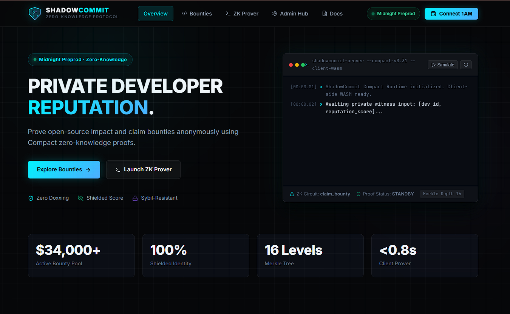
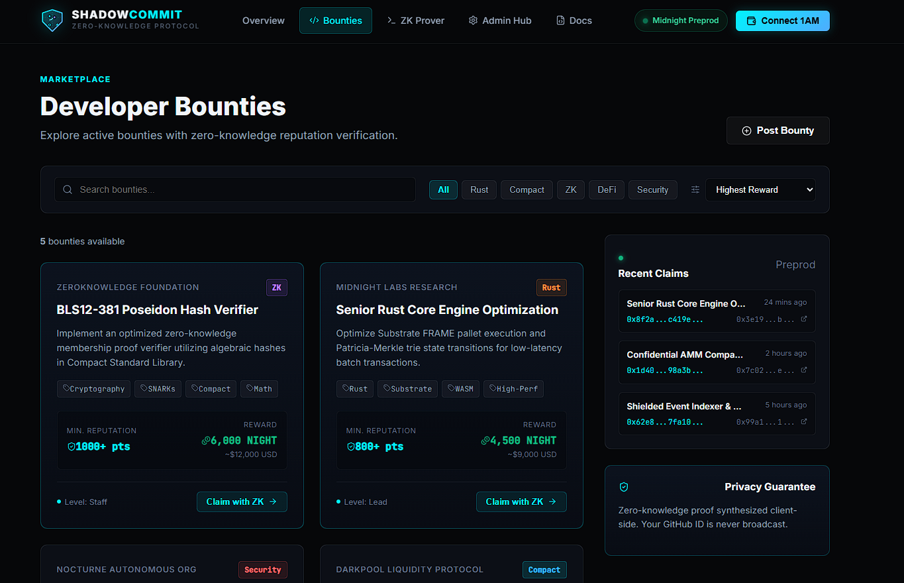
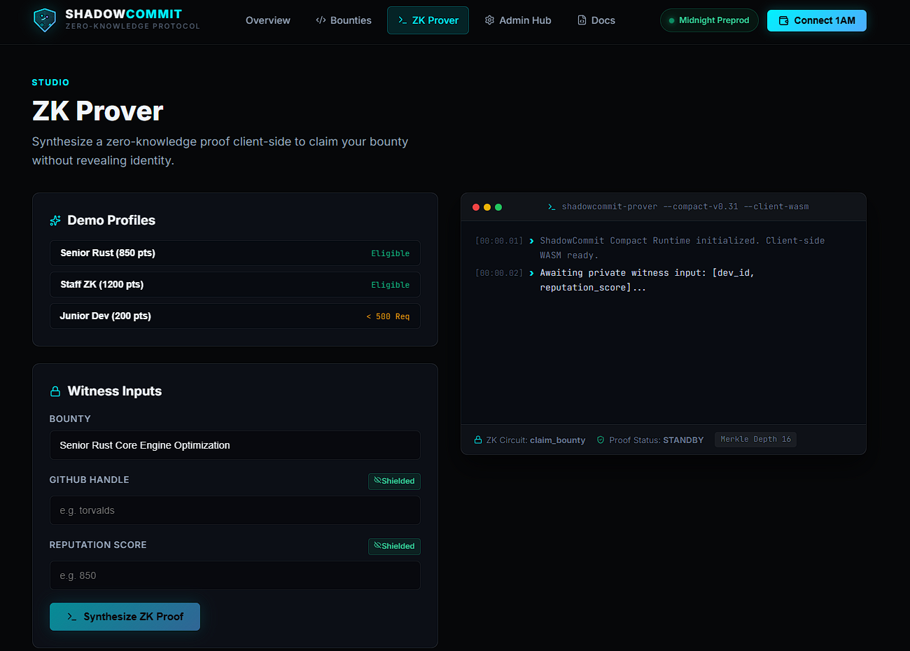

# 🌑 ShadowCommit

> **Decoupled Developer Reputation & Anonymous Bounty Protocol on Midnight Network**
> *Prove your open-source impact and claim bounties without ever revealing your real-world identity.*

[](https://explorer.1am.xyz/contract/c3a77cb03c27e0a9d119b14238497db9169ad3860e9ae2815b263021e3ddff5d)
[](https://midnight.network)
[](https://shadowcommit.netlify.app/)
[](https://shadowcommit.netlify.app/)
[](https://opensource.org/licenses/MIT)

---

## ⚡ Quick Navigation

| Resource | Link |
| :--- | :--- |
| 🌐 **Live Web dApp** | [https://shadowcommit.netlify.app/](https://shadowcommit.netlify.app/) |
| 📹 **Demo Video Walkthrough** | [Watch on Google Drive](https://drive.google.com/file/d/10Pvgt_9Hp61vneGx4GJh6fzv9B3uo1vW/view?usp=sharing) |
| 📜 **Deployed Smart Contract** | [`c3a77cb03c27e0a9d119b14238497db9169ad3860e9ae2815b263021e3ddff5d`](https://explorer.1am.xyz/contract/c3a77cb03c27e0a9d119b14238497db9169ad3860e9ae2815b263021e3ddff5d) |
| 🔍 **Deployment Transaction** | [View on 1AM Explorer (Preprod)](https://explorer.1am.xyz/tx/3f6a4aef289c86e0870356cd971734889179adb0ca41d8a6837081939d852053?network=preprod) |
| 💼 **Target Wallet** | [1AM Browser Extension](https://1am.xyz) (Midnight Testnet/Preprod) |
| 🐙 **Source Repository** | [https://github.com/barish245/ShadowCommit](https://github.com/barish245/ShadowCommit) |

---

## 📸 Application Showcase

### Video Walkthrough
📹 **[Watch the Complete End-to-End Demo Video](https://drive.google.com/file/d/10Pvgt_9Hp61vneGx4GJh6fzv9B3uo1vW/view?usp=sharing)** — *Demonstrates wallet connection, real-time client-side ZK proof synthesis, Merkle tree credential verification, and on-chain bounty claiming.*

---

### Application Preview

#### 1. Protocol Overview & Live Prover Terminal
*Interactive overview showing active bounty pool statistics, Merkle tree depth, zero-doxxing guarantees, and simulated real-time proof telemetry.*


#### 2. Developer Bounties Marketplace
*Curated bounties filtered by language (Rust, Compact, ZK, DeFi), reward values in NIGHT tokens, minimum required reputation scores, and direct "Claim with ZK" entrypoints.*


#### 3. Client-Side ZK Prover Studio
*Allows developers to select demo credentials or enter shielded GitHub handles and reputation scores to synthesize zero-knowledge proofs directly inside the browser.*


---

## 💡 Executive Summary

In open-source software and Web3, a developer's **reputation is permanently anchored to their real-world identity** (their personal GitHub handle, public Twitter, or doxxed wallet address). 

This introduces three critical dilemmas:
1. **The Moonlighter**: Elite senior engineers at Web2 tech giants (Google, Apple, Microsoft) who want to audit smart contracts or contribute to DeFi protocols, but are legally prohibited by corporate non-compete/IP assignment clauses.
2. **The Geopolitically Restricted**: Skilled developers in restrictive regimes or sanctioned territories who risk severe political and legal retaliation if they contribute to financial privacy tools under their legal name.
3. **The Meritocratic Contributor**: Developers who frequently encounter unconscious bias based on geographic location, gender, age, or lack of traditional credentials, and desire their pull requests to be judged solely on algorithmic merit.

### The Catch-22
- If a developer uses their real GitHub identity: they risk career, legal, and privacy repercussions.
- If a developer creates a fresh burner account: they have **zero reputation score**, project maintainers ignore their submissions, and they cannot qualify for high-tier developer bounties.

### The Solution: ShadowCommit
**ShadowCommit** leverages Midnight's privacy-first architecture to decouple **reputation** from **identity**. Using **Compact zero-knowledge smart contracts**, developers prove that their verified GitHub credentials meet or exceed a bounty's requirements **without revealing their username, their exact score, or linking their wallet to their identity**.

---

## 🔐 The Cryptographic Privacy Model

### Public Ledger State vs. Private Witnesses

| What the Public & Observers CAN See 👁️ | What Observers CANNOT See 🔒 |
| :--- | :--- |
| That *a valid developer* claimed bounty $X$ | The developer's GitHub username / User ID |
| Total number of claims completed | The developer's exact reputation score (only that $\text{score} \ge \text{threshold}$) |
| Public bounty IDs and required minimum scores | The oracle's private signing secret |
| The cryptographic root of the credential Merkle tree | The branch position/leaf index of the developer |
| Anonymous deterministic nullifiers ($\text{Hash}(\text{bounty\_id}, \text{dev\_id})$) | Any cryptographic link between wallet address and real persona |
| Protocol operational status (active / paused) | Whether two claims on different bounties belong to the same person |

### Sybil Resistance via Deterministic Nullifiers
To prevent a single high-reputation developer from draining a bounty multiple times across multiple burner wallets, ShadowCommit computes a deterministic **nullifier** inside the zero-knowledge circuit:

$$\text{nullifier} = \text{persistentHash}(\text{pad}(32, \text{"shadowcommit:null:v1"}), \text{bounty\_id}, \text{dev\_id})$$

- If the nullifier already exists in the on-chain `claimed` set, the transaction reverts.
- Because $\text{dev\_id}$ is shielded inside the hash, observers cannot reconstruct who the claimant is, yet the contract mathematically guarantees **one claim per developer per bounty**.

---

## 🏗️ Architecture & Five-Provider Pattern

```
┌────────────────────────────────────────────────────────────────────────┐
│                        Developer / Client Browser                      │
│                                                                        │
│   [ 1AM Browser Extension ]          [ React 19 Frontend dApp ]        │
│   • Unshielded NIGHT Keys            • Prover Terminal UI              │
│   • Anonymous Burner Account         • WASM Proof Synthesis Helper     │
└──────────────────┬───────────────────────────────┬─────────────────────┘
                   │                               │
                   │ Sign & Pay DUST Fees          │ Supply Private Witnesses:
                   │                               │ • dev_id (hashed identity)
                   │                               │ • reputation_score
                   │                               │ • Merkle path to root
                   ▼                               ▼
┌────────────────────────────────────────────────────────────────────────┐
│                     Midnight.js Five-Provider Stack                    │
│                                                                        │
│  1. WalletProvider:          1AM Wallet extension connector            │
│  2. PrivateStateProvider:    IndexedDB private witness storage         │
│  3. ZKConfigProvider:        Fetch Proving Keys (*.prover / *.zkir)    │
│  4. ProofProvider:           Proof Server / Client-side WASM engine    │
│  5. MidnightProvider:        GraphQL Indexer & Node submission         │
└──────────────────────────────────┬─────────────────────────────────────┘
                                   │
                                   │ Submit Proof-Verified Extrinsic
                                   ▼
┌────────────────────────────────────────────────────────────────────────┐
│               Midnight Blockchain (Substrate WASM Runtime)             │
│                                                                        │
│   ┌────────────────────────────────────────────────────────────────┐   │
│   │             ShadowCommit Compact Smart Contract                │   │
│   │                                                                │   │
│   │  • Check Merkle root:   oracle_credentials.checkRoot(...)      │   │
│   │  • Assert threshold:    witness.score >= bounty.min_score      │   │
│   │  • Check nullifier:     !claimed.member(nullifier)             │   │
│   │  • Register nullifier:  claimed.insert(nullifier)              │   │
│   │  • Increment:           total_claims = total_claims + 1        │   │
│   └────────────────────────────────────────────────────────────────┘   │
│                                                                        │
│   PUBLIC LEDGER:  bounties, claimed, total_claims, is_active           │
└────────────────────────────────────────────────────────────────────────┘
```

---

## 📜 Smart Contract Deep Dive (`shadowcommit.compact`)

Written in Midnight's native zero-knowledge smart contracting language, **Compact**:

### State Representation
```typescript
// Public ledger state visible to all network participants
export ledger oracle_credentials: MerkleTree<16, Bytes<32>>;  // Up to 65,536 attested developers
export ledger admin: Bytes<32>;                              // Admin public key commitment
export ledger bounties: Map<Bytes<32>, Uint<32>>;             // bounty_id -> min_reputation
export ledger claimed: Set<Bytes<32>>;                       // Nullifiers (Sybil prevention)
export ledger total_claims: Uint<32>;                        // Global claim counter
export ledger is_active: Boolean;                            // Circuit breaker / pause switch
```

### Circuit Specifications

| Circuit | Access | Description |
| :--- | :--- | :--- |
| `claim_bounty(bounty_id)` | **Public (ZK)** | Synthesizes a proof asserting that the caller owns an attested credential inside the Merkle tree with $\text{score} \ge \text{required}$, emits a nullifier, and updates state. |
| `issue_credential(commitment)` | **Admin Only** | Inserts a developer's credential hash ($\text{Hash}(\text{dev\_id}, \text{score})$) into the on-chain Merkle tree. |
| `add_bounty(bounty_id, min_score)` | **Admin Only** | Registers a new bounty requirement on-chain. |
| `update_config(active)` | **Admin Only** | Emergency pause/unpause circuit breaker. |

---

## 🚀 Deployed Preprod Contract

The ShadowCommit smart contract is deployed and operational on the **Midnight Preprod Network**:

- **Contract Address**:
  ```
  c3a77cb03c27e0a9d119b14238497db9169ad3860e9ae2815b263021e3ddff5d
  ```
- **Deployment Transaction Hash**:
  ```
  3f6a4aef289c86e0870356cd971734889179adb0ca41d8a6837081939d852053
  ```
- **Explorer Verification Link**:
  [https://explorer.1am.xyz/contract/c3a77cb03c27e0a9d119b14238497db9169ad3860e9ae2815b263021e3ddff5d](https://explorer.1am.xyz/contract/c3a77cb03c27e0a9d119b14238497db9169ad3860e9ae2815b263021e3ddff5d)

---

## 🛠️ Project Monorepo Structure

```
ShadowCommit/
├── contracts/                             # Midnight Compact smart contract layer
│   ├── shadowcommit.compact               # Core ZK circuits and ledger state
│   ├── index.ts                           # TypeScript contract wrappers and pure circuits
│   └── managed/                           # Generated compiler artifacts & proving keys
│       └── shadowcommit/
│           ├── contract/                  # JavaScript & d.ts bindings
│           └── keys/                      # Prover (*.prover) and verifier keys
├── frontend/                              # High-performance React 19 dApp
│   ├── index.html                         # Document mount point
│   ├── vite.config.ts                     # Top-level await & WASM bundling
│   ├── src/
│   │   ├── App.tsx                        # Client-side router & navigation
│   │   ├── index.css                      # Cyber-dark futuristic design system
│   │   ├── components/                    # Navbar, Footer, Logo, BountyCard, ProverTerminal
│   │   ├── contexts/WalletContext.tsx     # 1AM wallet provider & lifecycle hooks
│   │   ├── data/mockBounties.ts           # Seed developer bounties dataset
│   │   ├── lib/midnight.ts                # Midnight.js SDK integration & indexer queries
│   │   └── pages/                         # LandingPage, BountiesPage, ClaimPage, DevPage, AdminPage, DocsPage
│   └── public/managed/                    # Static contract bindings served to browser
├── src/                                   # Backend integration & test harness
│   ├── config.ts                          # Network configurations (local / preprod / preview)
│   ├── providers.ts                       # Five-Provider factory implementation
│   ├── wallet.ts                          # Headless HDWallet & DUST synchronizer
│   └── test/
│       └── shadowcommit.test.ts           # Full end-to-end Vitest test suite
├── scripts/
│   ├── compile.js                         # Compact compiler build automation
│   ├── copy-managed.js                    # Managed artifacts distribution to frontend
│   └── wait-for-dust.ts                   # DUST token readiness monitor
├── assets/                                # Media assets, screenshots, and demo video
│   ├── ss1.png                            # Overview & Terminal screenshot
│   ├── ss2.png                            # Bounties Marketplace screenshot
│   ├── ss3.png                            # ZK Prover Studio screenshot
│   └── demo.mp4                           # Local video demo recording
├── compose.yml                            # Local multi-service Midnight devnet
├── netlify.toml                           # Production Netlify edge headers & redirects
├── tsconfig.json                          # Strict TypeScript configurations
└── vitest.config.ts                       # Test runner configuration
```

---

## 💻 Quickstart & Local Development

### Prerequisites
- **Node.js**: `v22.x` or `v24.x`
- **Yarn**: `1.22.x`
- **Docker Desktop**: Running (for local Midnight devnet)
- **Compact Compiler**: `compactc v0.31.0`
- **1AM Wallet Extension**: Installed in Chrome / Brave

---

### Step 1: Clone & Install Dependencies
```bash
git clone https://github.com/barish245/ShadowCommit.git
cd ShadowCommit

# Install workspace root dependencies
yarn install

# Install frontend dependencies
cd frontend && yarn install && cd ..
```

---

### Step 2: Compile the Compact Contract
```bash
# Compiles contracts/shadowcommit.compact into contracts/managed/
yarn compile
```
*This command executes `scripts/compile.js`, runs `compactc`, and synchronizes all generated artifacts into `frontend/src/managed/` and `frontend/public/managed/`.*

---

### Step 3: Run the Local Midnight Devnet
```bash
# Launch local Substrate node, indexer GraphQL, and proof server
yarn env:up

# Monitor until your wallet accumulates sufficient DUST for fees
npx vite-node scripts/wait-for-dust.ts
```

---

### Step 4: Run Automated Tests
```bash
# Executes complete test suite against local network
yarn test:local
```

#### Test Suite Highlights
- ✅ Deploys the `ShadowCommit` contract with an authorized admin hash.
- ✅ Admin registers a new bounty (`bounty_id = sha256("senior-rust-dev")`, `min_score = 500`).
- ✅ Oracle issues a credential commitment into the 16-level Merkle tree.
- ✅ Developer synthesizes a valid ZK proof and claims the bounty anonymously.
- ✅ Validates **double-claim rejection** (ensuring nullifier prevents replay attacks).
- ✅ Validates **score threshold rejection** (rejecting developers with insufficient score).

---

### Step 5: Start the Frontend Application
```bash
cd frontend
yarn dev
```
Open **[http://localhost:5173](http://localhost:5173)** in your browser with the 1AM wallet active.

---

## 🛡️ Hackathon Submission Details

- **Event**: Midnight Network Hackathon — September 2026
- **Track**: Dev Tooling / Privacy-Preserving Applications
- **Author**: **[barish245](https://github.com/barish245)**
- **GitHub Repository**: [https://github.com/barish245/ShadowCommit](https://github.com/barish245/ShadowCommit)
- **Live dApp URL**: [https://shadowcommit.netlify.app/](https://shadowcommit.netlify.app/)
- **Demo Video Walkthrough**: [Google Drive Link](https://drive.google.com/file/d/10Pvgt_9Hp61vneGx4GJh6fzv9B3uo1vW/view?usp=sharing)

---

## 📄 License

This project is licensed under the **MIT License** — see the [LICENSE](LICENSE) file for details.
